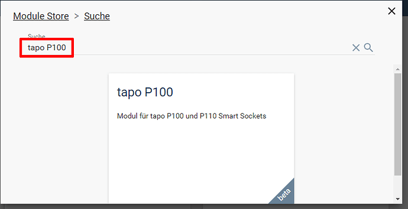
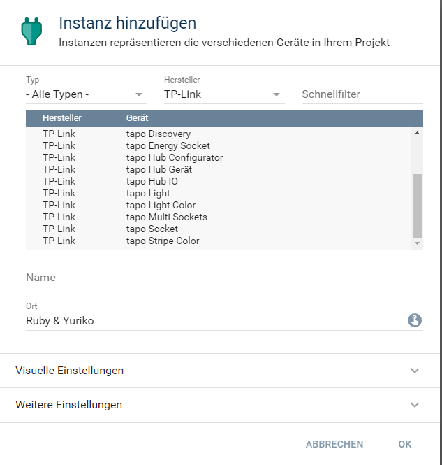
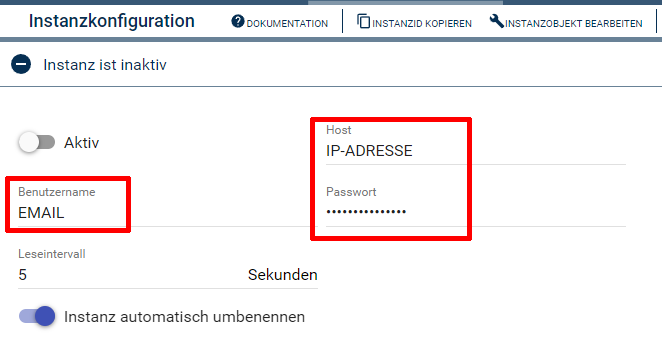
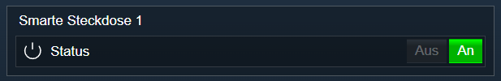

[](https://www.symcon.de/service/dokumentation/entwicklerbereich/sdk-tools/sdk-php/)
[](https://community.symcon.de/t/modulk-tp-link-tapo-p100-p110/131865)
[](https://www.symcon.de/service/dokumentation/installation/migrationen/v60-v61-q1-2022/)  
[](https://creativecommons.org/licenses/by-nc-sa/4.0/)
[](https://github.com/Nall-chan/tapo-SmartHome/actions)
[](https://github.com/Nall-chan/tapo-SmartHome/actions)  
[](#2-spenden)
[](#2-spenden)  

# tapo SmartHome <!-- omit in toc -->
Einbindung der TP-Link tapo SmartHome Geräte

## Inhaltsverzeichnis <!-- omit in toc -->

- [1. Funktionsumfang](#1-funktionsumfang)
- [2. Voraussetzungen](#2-voraussetzungen)
- [3. Software-Installation](#3-software-installation)
- [4. Einrichten der Instanzen in IP-Symcon](#4-einrichten-der-instanzen-in-ip-symcon)
- [5. Statusvariablen](#5-statusvariablen)
- [6. WebFront](#6-webfront)
- [7. PHP-Funktionsreferenz](#7-php-funktionsreferenz)
- [8. Aktionen](#8-aktionen)
- [9. Anhang](#9-anhang)
  - [1. Changelog](#1-changelog)
  - [2. Spenden](#2-spenden)
- [10. Lizenz](#10-lizenz)

## 1. Funktionsumfang

* Lokale Steuerung der WiFi Smart Sockets    
* Energiewerte auslesen (nur P110)  

## 2. Voraussetzungen

- IP-Symcon ab Version 6.1

## 3. Software-Installation

  Über den 'Module-Store' in IPS das Modul 'tapo SmartHome' hinzufügen.  
   **Bei kommerzieller Nutzung (z.B. als Errichter oder Integrator) wenden Sie sich bitte an den Autor.**  
 

## 4. Einrichten der Instanzen in IP-Symcon

 Unter `Instanz hinzufügen` sind die `tapo P100` und `tapo P110` Instanzen unter dem Hersteller `TP-Link` zu finden.  
   
	- Weitere Informationen zum Hinzufügen von Instanzen in der [Dokumentation der Instanzen](https://www.symcon.de/service/dokumentation/konzepte/instanzen/#Instanz_hinzufügen)

 ### Konfigurationsseite <!-- omit in toc -->

**Benutzername und Passwort sind die Cloud/App Zugangsdaten!**  
  

| Name       | Text                           | Beschreibung                                                          |
| ---------- | ------------------------------ | --------------------------------------------------------------------- |
| Open       | Aktiv                          | Verbindung zu Gerät herstellen                                        |
| Host       | Host                           | Adresse des Gerätes                                                   |
| Username   | Benutzername                   | Benutzername für die Anmeldung (TP-Cloud Benutzername: eMail-Adresse) |
| Password   | Passwort                       | Passwort für die Anmeldung (TP-Cloud Passwort)                        |
| Interval   | Leseintervall                  | Intervall der Abfrage von Status und Energiewerten (in Sekunden)      |
| AutoRename | Instanz automatisch umbenennen | Instanz erhält den Namen, welcher in der App vergeben wurde           |


## 5. Statusvariablen

| Ident | Initial Name | Typ     | Beschreibung                |
| ----- | ------------ | ------- | --------------------------- |
| State | Status       | boolean | Schaltzustand von dem Gerät |

## 6. WebFront

  

## 7. PHP-Funktionsreferenz


``` php
boolean TAPOSH_SwitchMode(integer $InstanzID, bool $State);
```
---  
``` php
boolean TAPOSH_SwitchModeEx(integer $InstanzID, bool $State, integer $Delay);
```
---  
``` php
boolean TAPOSH_RequestState(integer $InstanzID);
```
---  
``` php
array|false TAPOSH_GetDeviceInfo(integer $InstanzID);
```
---  

**Nur P110 Instanzen:**
``` php
array|false TAPOSH_GetEnergyUsage(integer $InstanzID);
```


## 8. Aktionen

TODO

## 9. Anhang

### 1. Changelog

Version 1.40:
 - Refactoring der 1.30  
 - Neu Verbinden überarbeitet  
 - Leseintervall wurde nicht gesetzt, wenn Gerät offline war, somit auch nie ein automatischer Reconnect wenn Gerät online ging  
 - War der Gerätename leer und `Instanz automatisch umbenennen` aktiv, so wurde der Name der Instanz gelöscht und es war ein `Unbenanntes Objekt`  
 - Cookie sollte sich jetzt automatisch verlängern und nicht mehr statisch sein (Errorcode 9999)

Version 1.30:
 - Neue Verschlüsselung wird unterstützt

Version 1.20:  
- Laufzeit wurde falsch berechnet und nicht als UTC abgelegt  
- Session Timeout wird abgefangen und ein automatischer reconnect wird versucht
- Fehlerbehandlung verbessert  
  
Version 1.10:  
- Energiemessung von P110 ergänzt    
  
Version 1.00:  
- Release Version für Symcon 6.1  

### 2. Spenden

  Die Library ist für die nicht kommerzielle Nutzung kostenlos, Schenkungen als Unterstützung für den Autor werden hier akzeptiert:  

<a href="https://www.paypal.com/donate?hosted_button_id=G2SLW2MEMQZH2" target="_blank"></a>

[](https://www.amazon.de/hz/wishlist/ls/YU4AI9AQT9F?ref_=wl_share) 

## 10. Lizenz

  IPS-Modul:  
  [CC BY-NC-SA 4.0](https://creativecommons.org/licenses/by-nc-sa/4.0/)  
