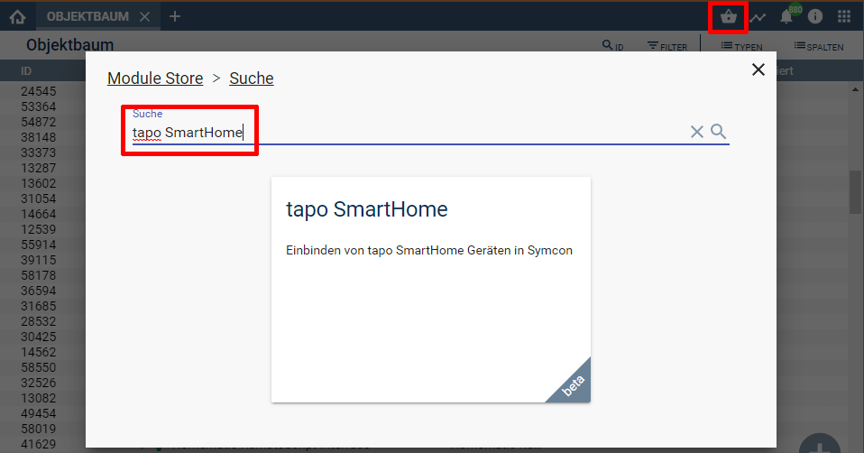

  

  

  

# tapo SmartHome <!-- omit in toc -->
Einbindung der TP-Link tapo SmartHome Geräte

## Inhaltsverzeichnis <!-- omit in toc -->

- [1. Funktionsumfang](#1-funktionsumfang)
  - [1. Nicht Geräte Instanzen](#1-nicht-geräte-instanzen)
    - [tapo Discovery](#tapo-discovery)
    - [tapo Configurator](#tapo-configurator)
    - [tapo Gateway](#tapo-gateway)
  - [2. Geräte Instanzen](#2-geräte-instanzen)
    - [tapo Light](#tapo-light)
    - [tapo P100](#tapo-p100)
    - [tapo P110](#tapo-p110)
- [2. Voraussetzungen](#2-voraussetzungen)
- [3. Software-Installation](#3-software-installation)
- [4. Einrichten der Instanzen in IP-Symcon](#4-einrichten-der-instanzen-in-ip-symcon)
- [5. Anhang](#5-anhang)
  - [1. Changelog](#1-changelog)
  - [2. Spenden](#2-spenden)
  - [6. Lizenz](#6-lizenz)

# 1. Funktionsumfang

 Komplett lokale Kommunikation mit den Geräten.  
 Die Geräte müssen aber in der TP-Link/tapo Cloud registriert sein, damit die lokale Anmeldung funktioniert!

## 1. Nicht Geräte Instanzen

### [tapo Discovery](Tapo%20Discovery/README.md)  
 - Auffinden von Geräten und Hubs im Netzwerk und Anlegen der Geräte bzw. Konfigurator-Instanz inklusive Gateway in IPS.  

### [tapo Configurator](Tapo%20Configurator/README.md)  
 - Einfaches Anlegen von Geräte-Instanzen welche mit einem Smart Hub verbunden sind.  
  (geplant; [Tester gesucht -> hier melden](https://community.symcon.de/t/modul-tp-link-tapo-smarthome/131865/))
  
### [tapo Gateway](Tapo%20Gateway/README.md)  
 - Smart Hub Instanz als Bindeglied zwischen angelernten tapo Geräten und Symcon.  

## 2. Geräte Instanzen

### [tapo Light](Tapo%20Light/README.md)  
  *  Lampe und LED Strip  

### [tapo P100](Tapo%20P100/README.md)  
  *  WiFi Smart Socket  

### [tapo P110](Tapo%20P110/README.md)  
  *  WiFi Smart Sockets mit Energiemessung   
  
# 2. Voraussetzungen

- IP-Symcon ab Version 6.1

# 3. Software-Installation

  Über den 'Module-Store' in IPS das Modul 'tapo SmartHome' hinzufügen.  
   **Bei kommerzieller Nutzung (z.B. als Errichter oder Integrator) wenden Sie sich bitte an den Autor.**  
  

# 4. Einrichten der Instanzen in IP-Symcon

Details sind direkt in der Dokumentation der jeweiligen Module beschrieben.  
Es wird empfohlen die Einrichtung mit der Discovery-Instanz zu starten ([tapo Discovery:](Tapo%20Discovery/README.md)).  

# 5. Anhang

## 1. Changelog

Version 1.60:
 - Discovery Modul zum einfachen auffinden von Geräten im Netzwerk ergänzt  
 - tapo Light Modul ergänzt  
 - Refactoring der 1.50 um weiterer Geräte und den Smart Hub zu integrieren  

Version 1.50:
 - Refactoring der 1.40  

Version 1.40:
 - Refactoring der 1.30  
 - Neu Verbinden überarbeitet  
 - Leseintervall wurde nicht gesetzt, wenn Gerät offline war, somit auch nie ein automatischer Reconnect wenn Gerät online ging  
 - War der Gerätename leer und `Instanz automatisch umbenennen` aktiv, so wurde der Name der Instanz gelöscht und es war ein `Unbenanntes Objekt`  
 - Cookie sollte sich jetzt automatisch verlängern und nicht mehr statisch sein (Errorcode 9999)

Version 1.30:
 - Neue Verschlüsselung wird unterstützt

Version 1.20:  
- Laufzeit wurde falsch berechnet und nicht als UTC abgelegt  
- Session Timeout wird abgefangen und ein automatischer reconnect wird versucht
- Fehlerbehandlung verbessert  
  
Version 1.10:  
- Energiemessung von P110 ergänzt    
  
Version 1.00:  
- Release Version für Symcon 6.1  

## 2. Spenden

  Die Library ist für die nicht kommerzielle Nutzung kostenlos, Schenkungen als Unterstützung für den Autor werden hier akzeptiert:  

 

## 6. Lizenz

  IPS-Modul:  
  [CC BY-NC-SA 4.0](https://creativecommons.org/licenses/by-nc-sa/4.0/)  
