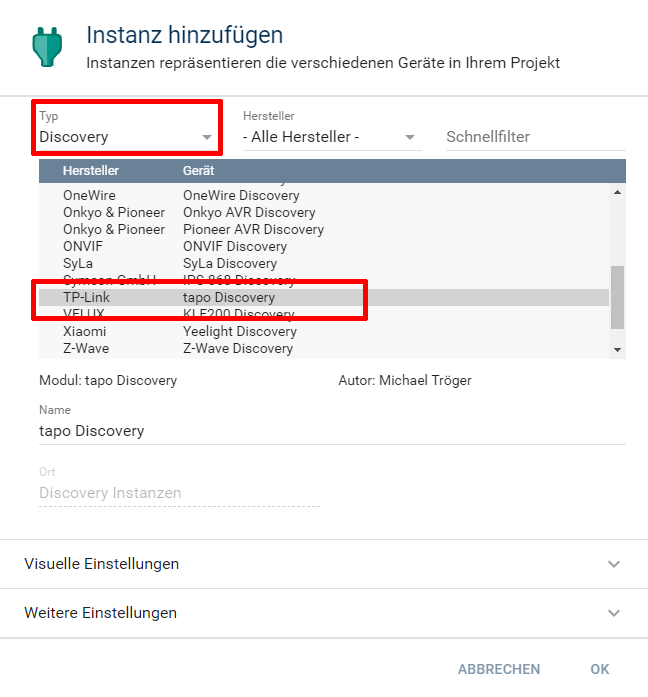

  

  

  
# tapo Discovery  <!-- omit in toc -->

## Inhaltsverzeichnis <!-- omit in toc -->

- [1. Funktionsumfang](#1-funktionsumfang)
- [2. Voraussetzungen](#2-voraussetzungen)
- [3. Software-Installation](#3-software-installation)
- [4. Einrichten der Instanzen in IP-Symcon](#4-einrichten-der-instanzen-in-ip-symcon)
- [5. Statusvariablen und Profile](#5-statusvariablen-und-profile)
- [6. PHP-Befehlsreferenz](#6-php-befehlsreferenz)
- [7. Aktionen](#7-aktionen)
- [8. Anhang](#8-anhang)
  - [1. Changelog](#1-changelog)
  - [2. Spenden](#2-spenden)
- [9. Lizenz](#9-lizenz)

## 1. Funktionsumfang

 - Auffinden von tapo SmartHome Geräten im Netzwerk.  
 - Einfaches Anlegen von dem benötigten Geräte Instanzen, oder den Konfiguratoren mit Gateway Instanzen.  
 
## 2. Voraussetzungen

- IP-Symcon ab Version 6.1 

## 3. Software-Installation

* Dieses Modul ist Bestandteil der [tapo SmartHome-Library](../README.md#3-software-installation).  
  
## 4. Einrichten der Instanzen in IP-Symcon

Eine einfache Einrichtung ist über diese Instanz möglich.  
Bei der installation aus dem Store wird das anlegen der Instanz automatisch angeboten.  

Bei der manuellen Einrichtung ist das Modul im Dialog `Instanz hinzufügen` unter den Hersteller `TP-Link` zu finden.  
  

Alternativ ist es auch in der Liste alle Discovery-Module aufgeführt.  
  

Die Suche im Netzwerk nutzt einen Broadcast auf Port 20002.

Damit Symcon mit den Geräten kommunizieren können, müssen diese in der TP-Link Cloud angemeldet und registriert sein.  
Die entsprechenden Cloud-Zugangsdaten sind in der Discovery-Instanz einzutragen, damit die Instanzen gleich mit den korrekten Daten erstellt werden.  
 ### Konfigurationsseite <!-- omit in toc -->

Über das selektieren eines Eintrages in der Tabelle und betätigen des dazugehörigen `Erstellen` Button,  
wird automatisch eine [Geräte-Instanz](../README.md#2-geräte-instanzen) erzeugt, sofern es sich **nicht** um einen Smart Hub handelt.  
Bei einem Smart Hub wird eine [Konfigurator-Instanz](../Tapo%20Configurator/README.md) und eine, [Gateway-Instanz](../Tapo%20Gateway/README.md) erzeugt.  

  
**Benutzername und Passwort sind die Cloud/App Zugangsdaten!**  

## 5. Statusvariablen und Profile

Dieses Modul erstellt keine Statusvariablen und Profile.  

## 6. PHP-Befehlsreferenz

Dieses Modul besitzt keine Instanz-Funktionen.

## 7. Aktionen

Es gibt keine speziellen Aktionen für dieses Modul.  

## 8. Anhang

### 1. Changelog

[Changelog der Library](../README.md#1-changelog)

### 2. Spenden

  Die Library ist für die nicht kommerzielle Nutzung kostenlos, Schenkungen als Unterstützung für den Autor werden hier akzeptiert:  

 

## 9. Lizenz

  IPS-Modul:  
  [CC BY-NC-SA 4.0](https://creativecommons.org/licenses/by-nc-sa/4.0/)  
  